# UX Design Specification - FSTrack-Tractor

**Author:** V
**Date:** 2026-01-09

---

## Executive Summary

### Project Vision

FSTrack-Tractor adalah aplikasi mobile untuk pelacakan lokasi traktor dan manajemen rencana kerja di perkebunan. MVP fokus pada **Login + Main Page** sebagai fondasi untuk fitur tracking dan approval di masa depan.

**Tech Stack:** Flutter (Android) + NestJS + PostgreSQL

**MVP Scope:** Login page + Main page dengan role-based UI

### Target Users

| Role | Persona | Primary Action | UI Layout |
|------|---------|----------------|-----------|
| **Kasie PG** | Pak Suswanto, 45th, 15 tahun di perkebunan | Membuat rencana kerja | 2 cards |
| **Kasie FE** | Field Executive Manager | Assign rencana ke operator | 2 cards |
| **Operator** | Pak Siswanto, 28th, familiar smartphone | Lihat tugas assigned | 1 card |
| **Mandor** | Supervisor | View only | 1 card |
| **Estate PG** | Estate manager | View only | 1 card |
| **Admin** | IT Admin (Pak Soswanti) | Testing & verification | 1 card |

**User Context:**
- Field workers di area perkebunan dengan sinyal 4G lemah
- Perangkat mid-range Android
- Mix tech-savviness (45th Kasie vs 28th Operator)
- Penggunaan pagi hari sebelum kerja lapangan

### Key Design Challenges

| Challenge | Description | Mitigation |
|-----------|-------------|------------|
| **Low-signal environment** | Field workers di area 4G lemah | Offline-first, JWT cache 7 hari |
| **Varied tech-savviness** | Kasie 45th vs Operator 28th | Simple UI, self-explanatory |
| **Role confusion** | 6 roles dengan UI berbeda | Clear visual differentiation |
| **First-time onboarding** | Users baru harus bisa pakai tanpa training | Max 3 slides, skip option |

### Design Opportunities

| Opportunity | Value |
|-------------|-------|
| **Personalized greeting** | "Selamat pagi, Pak Suswanto!" - meningkatkan engagement |
| **Contextual weather** | Membantu planning kerja lapangan |
| **Visual role distinction** | Kasie = 2 prominent cards, others = 1 simple card |
| **Quick re-login** | Saved accounts pattern dari Bulldozer app |

### Reference UI Patterns (Bulldozer App)

Dari `/home/v/work/vat-soil/frontend-vat-subsoil-tracker_apps-main`:
- Login page dengan tractor background image
- Username autocomplete dengan saved accounts
- Show/hide password toggle
- Remember Me checkbox
- BLoC state management
- Bottom navigation bar

## Core User Experience

### Defining Experience

**Primary User Action:** Login cepat → Lihat informasi tugas sesuai role dalam < 3 detik

**Core Loop:**
1. User buka app
2. Login (1 tap jika returning user)
3. Lihat greeting kontekstual + menu cards
4. Langsung tahu "apa yang harus dikerjakan"

### Platform Strategy

| Aspect | Decision | Rationale |
|--------|----------|-----------|
| **Platform** | Mobile Android (Flutter) | Field workers pakai Android |
| **Distribution** | APK direct install | Bypass Play Store untuk internal |
| **Interaction** | Touch-based | Mid-range smartphones |
| **Offline** | JWT cache 7 hari | Area perkebunan sinyal lemah |
| **Min Screen** | 5" display | Standard mid-range devices |

### Effortless Interactions

| Interaction | Goal | Implementation |
|-------------|------|----------------|
| Login (returning) | 1 tap | Saved accounts + Remember Me |
| Task clarity | Zero confusion | Role-based cards immediately visible |
| Weather check | Auto-available | Async load, graceful fallback |
| Error recovery | Self-explanatory | Bahasa Indonesia messages |

### Critical Success Moments

| Moment | Success Criteria |
|--------|------------------|
| **Login < 3 detik** | User lihat greeting dengan nama |
| **Task clarity** | User langsung tahu "apa yang harus dikerjakan" |
| **Role recognition** | Correct menu cards displayed |
| **First-time success** | Onboarding clear, no training needed |

### Experience Principles

| # | Principle | Description | Priority |
|---|-----------|-------------|----------|
| 1 | **Instant Task Clarity** | User langsung tahu tugas dalam < 3 detik | P0 |
| 2 | **Role Clarity** | UI langsung komunikasikan role via card layout | P0 |
| 3 | **Friction-Free Return** | 1 tap untuk returning users | P0 |
| 4 | **Progressive Enhancement** | Core tetap jalan, weather = enhancement | P0 |

### Contextual Greeting Pattern

| Condition | Greeting Example |
|-----------|------------------|
| Weather OK (pagi) | "Pagi cerah, Pak Suswanto! Cuaca bagus untuk kerja." |
| Weather fail | "Selamat pagi, Pak Suswanto!" |
| Siang | "Selamat siang, Pak Suswanto!" |
| Sore | "Selamat sore, Pak Suswanto!" |

*Note: Greeting pattern refined via Party Mode discussion with Sally (UX), John (PM), and Winston (Architect)*

## Desired Emotional Response

### Primary Emotional Goals

**Core Goal:** User merasa "SIAP KERJA" dalam 3 detik setelah login

| Target User | Desired Feeling |
|-------------|-----------------|
| Kasie PG | Confident & Prepared - "Aku siap mulai hari ini" |
| Operator | Clear & Ready - "Aku tahu tugasku" |
| First-time User | Welcome & Capable - "App ini mudah" |

### Emotional Journey Mapping

| Stage | Desired Emotion | UX Support |
|-------|-----------------|------------|
| App Open | Anticipation | Fast splash |
| Login | Effortless | 1 tap returning |
| Main Page | Clarity | Immediate content |
| Weather | Informed | Contextual greeting |
| Error | Calm | Clear Bahasa message |

### Micro-Emotions Priority

1. **Confidence** - "Aku tahu cara pakai"
2. **Trust** - "Info ini reliable"
3. **Efficiency** - "Tidak buang waktu"

### Design Implications

| Emotion | Design Approach |
|---------|-----------------|
| Confidence | Clear labels, consistent layout |
| Trust | Timestamps, reliable data sources |
| Efficiency | 1-tap login, skeleton loading |
| Calm | Friendly error messages |
| Belonging | Personalized greeting |

### Emotional Design Principles

| # | Principle | Implementation |
|---|-----------|----------------|
| 1 | **Familiarity First** | UI mirip app yang sudah dikenal (Bulldozer) |
| 2 | **No Surprises** | Predictable, consistent patterns |
| 3 | **Respectful of Time** | < 3 detik, always show feedback |
| 4 | **Human Touch** | Greeting dengan nama user |
| 5 | **Graceful Failure** | Friendly error handling in Bahasa |

## UX Pattern Analysis & Inspiration

### Inspiring Products Analysis

#### 1. Bulldozer App (Fas-Track Subsoil) - Primary Reference
Path: `/home/v/work/vat-soil/frontend-vat-subsoil-tracker_apps-main`

| Aspect | Pattern |
|--------|---------|
| Login | Saved accounts dengan autocomplete dropdown |
| Remember Me | Persistent credentials dengan secure storage |
| Visual | Tractor background image creates context |
| Password | Show/hide toggle - essential for field |
| State | BLoC pattern - clean state management |
| Version | Version number di login screen |

#### 2. WhatsApp - Secondary Reference
| Aspect | Pattern |
|--------|---------|
| Startup | Instant content load - no loading walls |
| Status | Timestamp trust ("Last seen", "Diperbarui") |
| Connectivity | "Connecting..." feedback |
| Profile | Simple nama + status di header |
| Action Color | Green = action |

### Transferable UX Patterns

| Pattern | Source | FSTrack Implementation |
|---------|--------|------------------------|
| Saved accounts | Bulldozer | Username autocomplete |
| Show/hide password | Bulldozer | Password field toggle |
| Instant content | WhatsApp | Skeleton → immediate content |
| Timestamp trust | WhatsApp | "Cuaca diperbarui 05:30 WIB" |
| Offline feedback | WhatsApp | "Mode offline" banner |
| Green action | WhatsApp | Primary button color (TBD) |

### Anti-Patterns to Avoid

| Anti-Pattern | Why Avoid | Instead Do |
|--------------|-----------|------------|
| Full-screen loading | Frustrating di slow connection | Skeleton loading, progressive |
| Complex onboarding | Field workers skip anyway | Max 3 slides, prominent skip |
| Hidden offline state | User bingung kenapa data lama | Clear "Offline" indicator |
| English error messages | Target users prefer Bahasa | All messages in Bahasa Indonesia |
| Small touch targets | Hard to tap with work gloves | Min 48dp touch targets |
| Auto-logout frequent | Frustrating re-login | 14 hari JWT cache |

### Design Inspiration Strategy

**ADOPT (langsung pakai):**
- Saved accounts autocomplete (Bulldozer)
- Show/hide password toggle (Bulldozer)
- Instant content loading (WhatsApp)
- Timestamp on data freshness (WhatsApp)
- Offline connectivity banner (WhatsApp)

**ADAPT (modifikasi):**
- WhatsApp green → Company brand color (TBD)
- WhatsApp chat list → Menu cards layout
- Bulldozer bottom nav → Simplified untuk MVP (no nav, single page)

**AVOID:**
- Complex onboarding flows
- Full-screen blocking loaders
- English-only error messages
- Frequent auto-logout

### SCAMPER Enhancements (Advanced Elicitation)

*Applied via SCAMPER creativity method - practical improvements without over-engineering*

| # | Enhancement | Implementation | Rationale |
|---|-------------|----------------|-----------|
| 1 | **Weather as prominent widget** | Dedicated weather widget di dashboard | Operational info untuk field work planning |
| 2 | **Offline indicator = Sync trigger** | Tap offline banner → manual sync | User control, bukan passive indicator |
| 3 | **Eliminate onboarding slides** | Contextual tooltips on first interaction | Zero friction, learn-by-doing |
| 4 | **Version → Settings** | Remove from login screen, move to profile/settings | Cleaner login UI |
| 5 | **Eliminate password complexity indicator** | No indicator needed | Passwords pre-set dari CSV import |
| 6 | **Task count on card badge** | "Lihat Rencana Kerja (3 pending)" | Function-focused, not in greeting |

### Updated Pattern Decisions

Based on SCAMPER + Party Mode review, berikut keputusan final untuk patterns:

**Main Page Layout (Function-First):**
```
┌─────────────────────────────────────┐
│ [WEATHER WIDGET - Prominent]        │  ← Operational info
│ ☀️ Cerah 26°C | 🕐 06:30 WIB        │
├─────────────────────────────────────┤
│ Selamat pagi, Pak Suswanto          │  ← Simple greeting
├─────────────────────────────────────┤
│ 📝 BUAT RENCANA KERJA               │  ← Primary action (Kasie only)
│ 📋 LIHAT RENCANA (3 pending)        │  ← Task count as badge
└─────────────────────────────────────┘
```

**Design Philosophy (Party Mode Consensus):**
| Principle | Decision | Rationale |
|-----------|----------|-----------|
| Function > Human Touch | Cards = fokus utama | Internal ops app, bukan consumer engagement |
| Weather = Operational | Prominent widget | Field workers need weather for planning |
| Greeting = Simple | Bukan hero header | Nice-to-have, not primary |
| PRD Alignment | Respect FR requirements | Checkbox tetap, no unauthorized deviations |

**Greeting Pattern (Simplified):**
| Condition | Format |
|-----------|--------|
| Pagi (05:00-11:00) | "Selamat pagi, Pak Suswanto" |
| Siang (11:00-15:00) | "Selamat siang, Pak Suswanto" |
| Sore (15:00-18:00) | "Selamat sore, Pak Suswanto" |
| Malam (18:00-05:00) | "Selamat malam, Pak Suswanto" |

*Note: Weather info NOT in greeting - displayed separately in weather widget*

**Weather Widget (Prominent):**
| Element | Display |
|---------|---------|
| Icon + Condition | ☀️ Cerah / 🌧️ Hujan / ⛅ Berawan |
| Temperature | 26°C |
| Time (WIB) | 🕐 06:30 WIB |
| Freshness | "Diperbarui 05:30 WIB" (subtle) |

**Offline Behavior (Updated):**
| State | UI | Action |
|-------|-----|--------|
| Online | No indicator | Normal operation |
| Offline | "Offline - Tap untuk sync" banner | Tap = queue sync, execute when online |
| Syncing | "Menyinkronkan..." with spinner | Auto-dismiss on complete |

**First-Time User (Updated):**
| Old Approach | New Approach |
|--------------|--------------|
| 3-slide onboarding modal | No modal, contextual tooltips |
| Skip button prominent | No skip needed |
| Blocks main content | Never blocks, appears on first interaction |

**Login Screen (PRD-Aligned):**
| Element | Decision | PRD Reference |
|---------|----------|---------------|
| Remember Me | ✅ Keep checkbox | FR3: "User dapat mengaktifkan 'Ingat Saya'" |
| Version number | Move to Settings | Cleaner login UI |
| Password complexity | Remove indicator | CSV pre-set passwords |
| Show/hide password | ✅ Keep toggle | FR2: "User dapat toggle visibility" |

## Design System Foundation

### Design System Choice

**Selected:** Material Design 3 dengan Custom Theme + Bulldozer Alignment

**Rationale:**
- Bulldozer reference app sudah pakai Material widgets - consistency maintained
- Flutter native = zero additional dependencies
- MVP timeline requires fastest path to implementation
- Field workers familiar dengan Android Material patterns
- Built-in accessibility untuk outdoor visibility conditions

### Bulldozer Reverse Engineering (Design Tokens)

*Extracted via Reverse Engineering method dari `/home/v/work/vat-soil/frontend-vat-subsoil-tracker_apps-main`*

#### Color System (Exact Match Required)

| Token | Hex Value | Usage |
|-------|-----------|-------|
| `primary` | `#008945` | Primary green, nav selected |
| `secondary` | `#03DAC6` | Teal accents |
| `background` | `#F5F5F5` | Page backgrounds |
| `textColor` | `#333333` | Primary text |
| `error` | `#B00020` | Error states |
| `buttonOrange` | `#FBA919` | Primary action buttons |
| `buttonBlue` | `#25AAE1` | Secondary action buttons |
| `greyCard` | `#F0F0F0` | Card backgrounds |
| `greyDate` | `#828282` | Timestamps, captions |
| `greenHome` | `#008945` | Home screen accent |

#### Typography System (Google Fonts Poppins)

| Token | Weight | Size | Usage |
|-------|--------|------|-------|
| `w400s8` | 400 | 8px | Micro text |
| `w400s10` | 400 | 10px | Caption |
| `w400s12` | 400 | 12px | Body small |
| `w500s10` | 500 | 10px | Caption emphasized |
| `w500s12` | 500 | 12px | Body |
| `w600s12` | 600 | 12px | Subtitle |
| `w700s13` | 700 | 13px | Title small |
| `w700s20` | 700 | 20px | Header / Title large |

#### Spacing & Layout Tokens

| Token | Value | Usage |
|-------|-------|-------|
| `paddingStandard` | 16px | Standard container padding |
| `paddingLarge` | 26px | Login screen, modal padding |
| `paddingCompact` | 8px | Between elements |
| `borderRadiusInput` | 8px | Input fields |
| `borderRadiusButton` | 0px | Buttons (square corners) |
| `borderRadiusCard` | 12px | Filter containers, cards |
| `borderWidthCard` | 0.5px | Card borders |
| `borderWidthInput` | 2px | Input field borders |
| `buttonHeight` | 60px | Standard button height |
| `touchTargetMin` | 48px | Minimum touch target (accessibility) |

#### Component Patterns (from Bulldozer)

| Component | Pattern | Notes |
|-----------|---------|-------|
| **TextInputGlobal** | OutlineInputBorder, 8px radius, grey default | Copy unchanged |
| **CustomCheckbox** | Material Checkbox + Row + Text label | Copy unchanged |
| **ElevatedButton** | Square corners, 60px height, custom colors | Extract to AppButtonStyles |
| **Card** | White background, 0.5px border, elevation minimal | Standard Material |

### Implementation Approach

#### File Structure
```
lib/
├── core/
│   └── config/
│       ├── app_colors.dart       # Exact copy dari Bulldozer
│       ├── app_text_styles.dart  # Exact copy dari Bulldozer
│       ├── app_button_styles.dart # NEW - extracted button styles
│       ├── app_spacing.dart      # NEW - spacing constants
│       └── app_assets.dart       # FSTrack-specific assets
├── widgets/
│   ├── text_input_global.dart    # Copy dari Bulldozer
│   ├── custom_checkbox.dart      # Copy dari Bulldozer
│   ├── weather_widget.dart       # NEW - FSTrack specific
│   └── offline_banner.dart       # NEW - FSTrack specific
```

#### Theme Configuration
```dart
ThemeData(
  colorScheme: ColorScheme.fromSeed(
    seedColor: Color(0xFF008945),
    brightness: Brightness.light,
  ),
  textTheme: GoogleFonts.poppinsTextTheme(),
  elevatedButtonTheme: ElevatedButtonThemeData(
    style: ElevatedButton.styleFrom(
      backgroundColor: Color(0xFFFBA919),
      minimumSize: Size(double.infinity, 60),
      shape: RoundedRectangleBorder(
        borderRadius: BorderRadius.zero,
      ),
    ),
  ),
  inputDecorationTheme: InputDecorationTheme(
    border: OutlineInputBorder(
      borderRadius: BorderRadius.circular(8),
    ),
    enabledBorder: OutlineInputBorder(
      borderSide: BorderSide(color: Colors.grey, width: 2),
      borderRadius: BorderRadius.circular(8),
    ),
  ),
)
```

### Customization Strategy

| Layer | Approach | Source |
|-------|----------|--------|
| **Colors** | Exact match Bulldozer AppColors | Reverse engineered |
| **Typography** | Poppins, same weight/size tokens | Reverse engineered |
| **Components** | Copy reusable widgets | TextInputGlobal, CustomCheckbox |
| **New Components** | Build on Material foundation | WeatherWidget, OfflineBanner |
| **Spacing** | Extract to constants | 8dp grid maintained |

### Consistency Checklist

| Aspect | Bulldozer | FSTrack-Tractor | Status |
|--------|-----------|-----------------|--------|
| Primary Color | #008945 | #008945 | ✅ Match |
| Button Orange | #FBA919 | #FBA919 | ✅ Match |
| Button Blue | #25AAE1 | #25AAE1 | ✅ Match |
| Font Family | Poppins | Poppins | ✅ Match |
| Input Border Radius | 8px | 8px | ✅ Match |
| Button Height | 60px | 60px | ✅ Match |
| Background | #F5F5F5 | #F5F5F5 | ✅ Match |
| Button Corners | Square (0px) | Square (0px) | ✅ Match |

### Code Review Findings (Advanced Elicitation)

*Applied via Code Review Gauntlet method - 4 senior dev perspectives*

#### Critical Changes Required

| Priority | Change | Rationale | Reviewer |
|----------|--------|-----------|----------|
| **P0** | Bundle Poppins font locally | Offline field workers, no network dependency | Performance Hawk |
| **P1** | Use AppColors constants in ThemeData | No magic hex values, maintainability | Purist |
| **P1** | Consolidate to 1-2 config files | MVP simplicity, reduce over-abstraction | Pragmatist |
| **P2** | Document structure difference dari Bulldozer | Future maintainer clarity | Bulldozer Expert |

#### Revised File Structure (Simplified for MVP)

```
lib/
├── core/
│   └── theme/
│       ├── app_theme.dart        # ALL-IN-ONE: colors, text, buttons, spacing
│       └── app_assets.dart       # Assets paths
├── widgets/
│   ├── text_input_global.dart    # Copy dari Bulldozer
│   ├── custom_checkbox.dart      # Copy dari Bulldozer
│   ├── weather_widget.dart       # NEW
│   └── offline_banner.dart       # NEW
assets/
└── fonts/
    ├── Poppins-Regular.ttf       # BUNDLED - offline support
    ├── Poppins-Medium.ttf
    ├── Poppins-SemiBold.ttf
    └── Poppins-Bold.ttf
```

#### Revised Theme Configuration

```dart
// lib/core/theme/app_theme.dart

// ============================================
// COLORS (from Bulldozer - exact match)
// ============================================
class AppColors {
  static const Color primary = Color(0xFF008945);
  static const Color secondary = Color(0xFF03DAC6);
  static const Color background = Color(0xFFF5F5F5);
  static const Color textColor = Color(0xFF333333);
  static const Color error = Color(0xFFB00020);
  static const Color buttonOrange = Color(0xFFFBA919);
  static const Color buttonBlue = Color(0xFF25AAE1);
  static const Color greyCard = Color(0xFFF0F0F0);
  static const Color greyDate = Color(0xFF828282);
}

// ============================================
// TYPOGRAPHY (Poppins - BUNDLED, not GoogleFonts)
// ============================================
class AppTextStyle {
  static const _fontFamily = 'Poppins';

  static TextStyle get w400s10 => TextStyle(
    fontFamily: _fontFamily, fontWeight: FontWeight.w400, fontSize: 10);
  static TextStyle get w400s12 => TextStyle(
    fontFamily: _fontFamily, fontWeight: FontWeight.w400, fontSize: 12);
  static TextStyle get w500s12 => TextStyle(
    fontFamily: _fontFamily, fontWeight: FontWeight.w500, fontSize: 12);
  static TextStyle get w600s12 => TextStyle(
    fontFamily: _fontFamily, fontWeight: FontWeight.w600, fontSize: 12);
  static TextStyle get w700s20 => TextStyle(
    fontFamily: _fontFamily, fontWeight: FontWeight.w700, fontSize: 20);
}

// ============================================
// SPACING
// ============================================
class AppSpacing {
  static const double xs = 8;
  static const double sm = 12;
  static const double md = 16;
  static const double lg = 24;
  static const double xl = 32;
  static const double buttonHeight = 60;
  static const double inputRadius = 8;
}

// ============================================
// THEME DATA (uses constants, no magic numbers)
// ============================================
ThemeData appTheme() => ThemeData(
  colorScheme: ColorScheme.fromSeed(
    seedColor: AppColors.primary,  // ✅ Constant reference
    brightness: Brightness.light,
  ),
  scaffoldBackgroundColor: AppColors.background,
  fontFamily: 'Poppins',  // ✅ Bundled font
  elevatedButtonTheme: ElevatedButtonThemeData(
    style: ElevatedButton.styleFrom(
      backgroundColor: AppColors.buttonOrange,  // ✅ Constant reference
      foregroundColor: Colors.white,
      minimumSize: Size(double.infinity, AppSpacing.buttonHeight),
      shape: RoundedRectangleBorder(
        borderRadius: BorderRadius.zero,
      ),
    ),
  ),
  inputDecorationTheme: InputDecorationTheme(
    border: OutlineInputBorder(
      borderRadius: BorderRadius.circular(AppSpacing.inputRadius),
    ),
    enabledBorder: OutlineInputBorder(
      borderSide: BorderSide(color: Colors.grey, width: 2),
      borderRadius: BorderRadius.circular(AppSpacing.inputRadius),
    ),
  ),
);
```

#### pubspec.yaml Font Configuration

```yaml
flutter:
  fonts:
    - family: Poppins
      fonts:
        - asset: assets/fonts/Poppins-Regular.ttf
          weight: 400
        - asset: assets/fonts/Poppins-Medium.ttf
          weight: 500
        - asset: assets/fonts/Poppins-SemiBold.ttf
          weight: 600
        - asset: assets/fonts/Poppins-Bold.ttf
          weight: 700
```

#### Structure Difference Documentation

| Aspect | Bulldozer | FSTrack-Tractor | Why Different |
|--------|-----------|-----------------|---------------|
| File pattern | `part of 'configs.dart'` | Separate imports | Cleaner dependency graph |
| Fonts | GoogleFonts (network) | Bundled assets | Offline field support |
| Button styles | Inline per widget | Centralized theme | Consistency enforcement |
| Spacing | Hardcoded values | AppSpacing constants | Maintainability |

### V's Signature Improvements (Party Mode Consensus)

*"Learn from Bulldozer, then level up" - Improvements yang membedakan FSTrack-Tractor*

#### Selected Improvements (MVP Scope)

| # | Improvement | Effort | Impact | Why It Matters |
|---|-------------|--------|--------|----------------|
| **1** | 🌟 **Skeleton Loading** | Low | High | Modern feel, perceived performance boost |
| **2** | 📴 **Explicit Offline UX** | Medium | High | New capability Bulldozer tidak punya |
| **3** | 📝 **Professional Documentation** | Low | Very High | Shows V is professional, not just coding |

#### Implementation Details

**1. Skeleton Loading (vs Bulldozer's CircularProgressIndicator)**

```dart
// BULLDOZER (boring, feels slow):
if (state.status == Status.loading) {
  return Center(child: CircularProgressIndicator());
}

// FSTRACK-TRACTOR (modern, feels instant):
if (state.status == Status.loading) {
  return Shimmer.fromColors(
    baseColor: AppColors.greyCard,
    highlightColor: Colors.white,
    child: WeatherWidgetSkeleton(),
  );
}
```

| Screen | Skeleton Component |
|--------|-------------------|
| Main Page | `WeatherWidgetSkeleton` - grey box with shimmer |
| Main Page | `RoleCardSkeleton` - card placeholder |
| Login | No skeleton needed (instant) |

**2. Explicit Offline UX (New Capability)**

| State | Bulldozer | FSTrack-Tractor |
|-------|-----------|-----------------|
| Offline | Silent, user confused | Banner: "Offline - Tap untuk sync" |
| Data stale | No indication | Timestamp: "Diperbarui 05:30 WIB" |
| Sync queued | Not supported | Toast: "Akan sync saat online" |
| Back online | Silent | Auto-sync + success feedback |

```dart
// lib/widgets/offline_banner.dart
class OfflineBanner extends StatelessWidget {
  final VoidCallback onSyncTap;

  @override
  Widget build(BuildContext context) {
    return GestureDetector(
      onTap: onSyncTap,
      child: Container(
        color: AppColors.greyDate,
        padding: EdgeInsets.symmetric(vertical: AppSpacing.xs),
        child: Row(
          mainAxisAlignment: MainAxisAlignment.center,
          children: [
            Icon(Icons.cloud_off, size: 16, color: Colors.white),
            SizedBox(width: 8),
            Text('Offline - Tap untuk sync',
              style: AppTextStyle.w500s12.copyWith(color: Colors.white)),
          ],
        ),
      ),
    );
  }
}
```

**3. Professional Documentation**

| Document | Bulldozer | FSTrack-Tractor |
|----------|-----------|-----------------|
| UX Design Spec | ❌ None | ✅ This document |
| PRD | ❌ None | ✅ Complete |
| Architecture Decisions | ❌ None | ✅ In UX Spec + future ADR |
| Code Comments | Minimal | Meaningful on complex logic |
| README | Basic | Setup + architecture overview |

#### Additional Quick Wins (Post-MVP)

| Improvement | Description | Effort |
|-------------|-------------|--------|
| **AppFeedback utility** | Centralized error/success handling | Low |
| **Golden tests** | Visual regression testing for critical screens | Low |
| **Feature-based folders** | `lib/features/login/`, `lib/features/main_page/` | Low |
| **Freezed unions** | Type-safe BLoC events | Medium |

#### Bulldozer Pain Points Avoided

| Bulldozer Issue | Evidence | FSTrack-Tractor Solution |
|-----------------|----------|--------------------------|
| Hardcoded role IDs | `if (userId == 32)` | Config-driven mapping |
| No error boundaries | Crash = white screen | Graceful fallback UI |
| GoogleFonts network | First load latency | Bundled Poppins fonts |
| Flat file structure | 100+ files in `/pages` | Feature-based folders |
| Zero test coverage | No tests found | Golden tests on critical paths |
| No documentation | README only | Full UX Spec + PRD |

#### Demo Script for Stakeholders

When presenting FSTrack-Tractor:

1. **"Lihat loading-nya"** → Skeleton shimmer vs spinner
2. **"Coba matikan WiFi"** → Offline banner muncul, tap to sync
3. **"Baca dokumentasinya"** → Show UX Spec, PRD
4. **"Compare dengan Bulldozer"** → Side-by-side perceived speed

**Expected Response:** "V ini profesional, bukan cuma ngoding asal jalan."

## Defining Core Experience

### The Defining Interaction

**One-liner:** "Login → Langsung tahu tugasku"

**User will say:** "Buka app, langsung lihat apa yang harus dikerjakan hari ini"

**Why this matters:** Field workers di perkebunan butuh clarity, bukan complexity. Mereka buka app pagi-pagi, mau langsung tahu: cuaca bagus? Ada tugas apa? Siapa yang harus saya hubungi?

### User Mental Model

| User Type | Mental Model | Expectation |
|-----------|--------------|-------------|
| **Kasie PG** | "Saya yang buat rencana" | Prominent "Buat Rencana" button |
| **Kasie FE** | "Saya yang assign" | List rencana + assign action |
| **Operator** | "Saya yang eksekusi" | Clear task assigned to me |
| **Mandor** | "Saya yang monitor" | Overview of team progress |

**Current Solution:** Paper-based, verbal instructions, WhatsApp groups

**Pain Points:** Lost papers, forgotten instructions, no weather check, unclear assignments

### Success Criteria

| Criteria | Measurement | Target |
|----------|-------------|--------|
| Time to clarity | Stopwatch from login to task visible | < 3 seconds |
| Role recognition | Correct cards displayed | 100% accuracy |
| Weather visibility | Widget prominently displayed | Above fold |
| Offline awareness | Banner visibility | < 1 second |
| Action clarity | User knows next step | Zero confusion |

### Experience Mechanics

**1. Initiation (Login)**
- Trigger: App icon tap
- Saved account dropdown → 1 tap login
- New user: Username + Password + Remember Me
- Loading: Skeleton shimmer (not spinner)

**2. Interaction (Main Page)**
- Weather widget: Prominent, operational info
- Greeting: Simple, time-based, with name
- Role Cards:
  - Kasie: 2 cards (Buat + Lihat)
  - Others: 1 card (Lihat)
- Task count: Badge on "Lihat" card

**3. Feedback**
- Success: Content appears smoothly (skeleton → real data)
- Offline: Grey banner "Offline - Tap untuk sync"
- Error: Friendly card with retry button
- Loading: Shimmer animation, not blocking

**4. Completion**
- User sees their tasks
- Taps card to take action
- Feels: "Siap kerja!"

### Pattern Classification

| Pattern | Type | Source |
|---------|------|--------|
| Saved accounts login | Established | Bulldozer, banking apps |
| Card-based actions | Established | Material Design |
| Weather widget | Established | Phone home screens |
| Skeleton loading | Modern Adaptation | Content apps |
| Tappable offline banner | Novel Adaptation | WhatsApp-inspired |
| Role-based UI | Established | Enterprise apps |

**User Education Required:** None - all patterns familiar to Android users

## Visual Design Foundation

### Semantic Color Mapping

| Semantic | Token | Hex | Usage |
|----------|-------|-----|-------|
| Primary | `primary` | `#008945` | Brand, success states |
| Primary Action | `buttonOrange` | `#FBA919` | CTAs, primary buttons |
| Secondary Action | `buttonBlue` | `#25AAE1` | Secondary buttons |
| Success | `primary` | `#008945` | Success feedback |
| Warning | `buttonOrange` | `#FBA919` | Warning states |
| Error | `error` | `#B00020` | Error states |
| Surface | `background` | `#F5F5F5` | Page backgrounds |
| Card | `greyCard` | `#F0F0F0` | Card backgrounds |
| On Surface | `textColor` | `#333333` | Text on light bg |
| On Primary | `white` | `#FFFFFF` | Text on primary |

### Typography Hierarchy

| Level | Style | Usage |
|-------|-------|-------|
| H1 | `w700s20` | Screen titles |
| H2 | `w600s12` | Section headers |
| Body | `w500s12` | Primary content |
| Body Small | `w400s12` | Secondary content |
| Caption | `w400s10` | Timestamps, hints |

### Layout Principles

| Principle | Value | Rationale |
|-----------|-------|-----------|
| Base Unit | 8dp | Material Design standard |
| Standard Padding | 16px | Efficient content density |
| Section Gap | 24px | Clear visual separation |
| Button Height | 60px | Touch-friendly for field |
| Input Radius | 8px | Consistent with Bulldozer |
| Card Elevation | 0-2dp | Subtle, not distracting |

### Accessibility Compliance

| Requirement | Target | Status |
|-------------|--------|--------|
| Text Contrast | WCAG AA (4.5:1) | ✅ Achieved (10.5:1) |
| Touch Targets | 48dp minimum | ✅ Achieved (60dp buttons) |
| Font Legibility | 10px minimum | ✅ Achieved |
| Color Independence | Info not by color alone | ✅ Icons + text labels |
| Offline Support | No network-dependent fonts | ✅ Poppins bundled |

## Design Direction Decision

### Design Directions Explored

Enam design directions dieksplorasi untuk FSTrack-Tractor:

1. **Clean Professional** - Minimal, high whitespace, corporate feel
2. **Dense Functional** - Compact, info-rich, efficient
3. **Warm Friendly** - Rounded corners, soft shadows, approachable
4. **Bold Industrial** - Dark theme, high contrast, field-tough
5. **Card Focused** - Elevated cards, prominent shadows, modern
6. **Bulldozer Evolution** - Familiar Bulldozer style + V's improvements

**Visual Assets Generated:**
- `ux-design-directions.html` - 6 design directions exploration
- `ux-final-direction.html` - Final chosen direction with interactions

### Chosen Direction

**Hybrid: Bulldozer Evolution + Warm Friendly**

Kombinasi yang mempertahankan familiarity dengan Bulldozer (untuk users yang sudah terbiasa) sambil menambahkan warmth dan approachability dari Warm Friendly direction.

| Aspect | Decision |
|--------|----------|
| Color Tokens | Bulldozer exact match (#008945, #FBA919, #25AAE1) |
| Corner Radius | Warm Friendly style (16-20px, rounded) |
| Shadows | Soft, layered |
| Typography | Poppins bundled |
| Loading State | Skeleton (V's signature) |
| Offline State | Tappable banner (V's signature) |

### Design Rationale

1. **Familiarity** - Users sudah kenal dengan Bulldozer, transisi harus smooth
2. **Rounded corners** - Lebih friendly dan modern tanpa kehilangan profesionalisme
3. **Soft shadows** - Memberikan depth tanpa terlalu heavy
4. **V's Improvements** - Skeleton loading dan explicit offline UX meningkatkan perceived performance dan reliability

### Implementation Approach

#### Card Pattern (Rencana Kerja)

Cards menampilkan summary info saja, tanpa button. Seluruh card tappable.

```
┌─────────────────────────────────────┐
│ 📍 002C                     [OPEN] │  ← Lokasi prominent + status badge
│ 📅 08 Januari 2026                 │  ← Tanggal readable
│ 🚜 CD8019 • 👤 Andre Sukma         │  ← Details compact
└─────────────────────────────────────┘
         ↓ Tap anywhere
      Bottom Sheet muncul
```

**Card Variants by Status:**
- `OPEN` - Border-left orange (#FBA919)
- `CLOSED` - Border-left green (#008945)
- `ASSIGNED` - Border-left blue (#25AAE1)

#### Bottom Sheet Pattern

Konsisten untuk semua aksi utama:

**1. Detail Rencana Kerja (saat card di-tap):**
- Header: Lokasi + Tanggal
- Content: Detail lengkap (Tanggal, Status, Unit, Operator, PG, Shift)
- Actions: Edit (semua role) + Validasi (Kasie only)
- Swipe down atau tap outside untuk dismiss

**2. Buat Rencana Kerja (saat FAB di-tap):**
- Header: "Buat Rencana Kerja"
- Content: Form (Tanggal, PG, Lokasi, Shift)
- Actions: Batal + Buat Rencana
- Form dalam bottom sheet, bukan full page

#### FAB (Floating Action Button)

| Attribute | Value |
|-----------|-------|
| Position | Kanan bawah |
| Color | Primary green (#008945) |
| Icon | "+" |
| Size | 56dp |
| Visibility | **Kasie only** |
| Action | Open "Buat Rencana Kerja" bottom sheet |

#### Role-Based UI Differences

Perbedaan antar role dibuat subtle:

| Element | Kasie | Operator/Mandor |
|---------|-------|-----------------|
| Card list | Identical | Identical |
| Weather widget | Identical | Identical |
| Greeting | Identical | Identical |
| **FAB** | ✅ Visible | ❌ Hidden |
| Bottom sheet | Full actions | No Validasi |

#### Bottom Sheet Actions by Role

| Action | Kasie | Operator | Mandor |
|--------|-------|----------|--------|
| View Detail | ✅ | ✅ | ✅ |
| Edit | ✅ | ✅ | ❌ |
| Validasi | ✅ | ❌ | ❌ |

---

## User Journey Flows

Detailed interaction flows untuk 2 persona MVP utama berdasarkan PRD user journeys.

### Journey 1: Kasie PG - Memulai Hari & Membuat Rencana Kerja

**Persona:** Pak Suswanto, 45th, Kasie PG Estate Sungai Lilin

**Goal:** Login → Lihat kondisi cuaca → Buat/lihat rencana kerja → Siap koordinasi tim


**Flow Metrics:**
- **Time to Aha Moment:** < 3 detik (greeting + weather visible)
- **Taps to primary action:** 2 taps (FAB → Submit)
- **Error recovery:** Inline message, no page reload

**Key Interaction Points:**
1. **Auto-login** - Remember Me mempercepat returning users
2. **Skeleton loading** - Perceived performance improvement
3. **FAB visibility** - Hanya Kasie yang lihat, clear affordance untuk create
4. **Bottom sheet consistency** - Semua aksi utama via bottom sheet

---

### Journey 2: Operator - Cek Tugas & Mulai Kerja

**Persona:** Pak Siswanto, 28th, Operator traktor

**Goal:** Login → Cek tugas hari ini → Mulai kerja → Submit hasil (future phase)

```mermaid
flowchart TD
    subgraph LOGIN["🔐 LOGIN FLOW"]
        A["Buka App di Pool Traktor"] --> B{"Sudah Login?"}
        B -->|"Yes + Remember Me"| C["Auto-login"]
        B -->|"No"| D["Login Screen"]
        D --> E["Input Credentials"]
        E --> F["✅ Centang Remember Me"]
        F --> G{"Valid?"}
        G -->|"No"| H["Error + Retry"]
        H --> E
        G -->|"Yes"| I["JWT Cached 7 hari"]
        C --> I
    end
    
    subgraph MAIN["🏠 MAIN PAGE - OPERATOR"]
        I --> J["Main Page Load"]
        J --> K["Skeleton Loading"]
        K --> L["👋 Selamat pagi, Pak Siswanto!"]
        K --> M["☀️ Cerah, 28°C | 🕐 06:02 WIB"]
        K --> N["1 Menu Card Only<br/>Full Width"]
    end
    
    subgraph TASK["📋 LIHAT TUGAS"]
        N --> O["Tap: Lihat Rencana Kerja"]
        O --> P["List Cards - Tugas Assigned"]
        P --> Q{"Ada Tugas?"}
        Q -->|"Tidak"| R["Empty State<br/>Belum ada tugas hari ini"]
        Q -->|"Ya"| S["Cards dengan Status"]
        S --> T{"Tap Card"}
        T --> U["Bottom Sheet: Detail Tugas"]
        U --> V["Lihat: Lokasi, Shift, Unit"]
        V --> W{"Action?"}
        W -->|"Edit"| X["Edit Minor Details"]
        W -->|"Start Work"| Y["🚜 GPS Active<br/>Future Phase"]
        W -->|"Close"| Z["Dismiss"]
    end
    
    subgraph OFFLINE["📴 OFFLINE SCENARIO"]
        N --> AA{"Online?"}
        AA -->|"No"| AB["Tappable Offline Banner"]
        AB --> AC["Cached Data Shown<br/>Last Updated: timestamp"]
        AB --> AD{"Tap Banner"}
        AD --> AE["Retry Sync"]
    end
    
    style LOGIN fill:#e8f5e9
    style MAIN fill:#e3f2fd
    style TASK fill:#fff3e0
    style OFFLINE fill:#ffebee
```



**Flow Metrics:**
- **Time to task clarity:** < 3 detik
- **Offline resilience:** Full task list dari cache
- **Taps to see task:** 2 taps (card → detail)

**Key Interaction Points:**
1. **Remember Me default** - Operator di lapangan butuh quick access
2. **1 card layout** - Simpler, focused, no confusion
3. **Offline banner** - Explicit, tappable, tidak blocking
4. **Cached tasks** - Bisa lihat tugas walaupun offline

---

### Journey Patterns & Optimizations

#### Common Patterns Across Journeys

| Pattern | Implementation | Benefit |
|---------|---------------|---------|
| **Auto-login** | JWT + Remember Me | < 1 tap untuk returning users |
| **Skeleton loading** | Shimmer placeholders | Perceived speed improvement |
| **Bottom sheet** | Consistent untuk detail + create | Predictable interactions |
| **Inline errors** | Toast + field highlight | No page reload needed |
| **Offline indicator** | Tappable banner | Explicit status, retry action |

#### Flow Optimization Principles

1. **Minimize taps** - Every action reachable in ≤ 3 taps
2. **Progressive disclosure** - Summary → Detail via bottom sheet
3. **Role-appropriate UI** - FAB hidden untuk non-creators
4. **Offline-first** - Cache everything, sync when possible
5. **Contextual feedback** - Weather + time untuk decision support

#### Edge Case Flows

| Scenario | Handling |
|----------|----------|
| JWT expired mid-session | Graceful redirect to login, no crash |
| Weather API timeout | "Cuaca tidak tersedia" + cached data |
| Network switch mid-action | Queue action, sync on reconnect |
| App backgrounded | Resume state on foreground |
| First launch offline | "Koneksi diperlukan untuk login pertama" |

---

## Component Strategy

### Design System Foundation

FSTrack-Tractor menggunakan **Material Design 3** dengan custom theme. Komponen standar M3 digunakan tanpa modifikasi untuk:

- Buttons (ElevatedButton, TextButton, OutlinedButton)
- Text fields (TextFormField dengan InputDecoration)
- Cards (Card widget dengan elevation)
- Bottom sheets (showModalBottomSheet)
- App bar (SliverAppBar untuk scroll behavior)
- Navigation (BottomNavigationBar)
- Lists (ListView, ListTile)
- Dialogs (AlertDialog, SimpleDialog)
- Progress indicators (CircularProgressIndicator, LinearProgressIndicator)
- Snackbars (SnackBar untuk toast messages)

**Reference:** [Material Design 3 Components](https://m3.material.io/components)

### Custom Components

Empat komponen custom yang spesifik untuk FSTrack-Tractor:

---

#### 1. WeatherWidget

**Purpose:** Menampilkan kondisi cuaca dan suhu untuk decision support kerja lapangan.

**Location:** Main page header

**States:**
| State | Display |
|-------|---------|
| Loading | Skeleton shimmer (icon + text placeholder) |
| Success | "🌤️ Cerah, 26°C" |
| Cached | "🌤️ Cerah, 26°C" + "(06:30 WIB)" timestamp |
| Error | "Cuaca tidak tersedia" |

**Props:**
- `temperature`: double? (nullable for error state)
- `condition`: WeatherCondition enum
- `lastUpdated`: DateTime? (for cache indicator)
- `isLoading`: bool

**Accessibility:**
- Semantic label: "Cuaca hari ini: Cerah, suhu 26 derajat Celsius"
- Icon + text untuk non-color-dependent info

---

#### 2. OfflineBanner

**Purpose:** Indikator eksplisit saat app offline, dengan aksi retry.

**Location:** Below header, above content

**States:**
| State | Display | Action |
|-------|---------|--------|
| Online | Hidden | - |
| Offline | "📴 Mode Offline • Tap untuk sync" | Retry sync |
| Syncing | "🔄 Menyinkronkan..." | Disabled |
| Sync Failed | "❌ Sync gagal • Tap untuk coba lagi" | Retry |

**Appearance:**
- Background: `#FFEBEE` (light red)
- Text: `#B00020` (error color)
- Height: 48dp (tappable)
- Full width, sticky below header

**Props:**
- `isOnline`: bool
- `isSyncing`: bool
- `lastSyncTime`: DateTime?
- `onRetry`: VoidCallback

**Accessibility:**
- Tappable area 48dp minimum
- Announce state changes to screen reader

---

#### 3. GreetingHeader

**Purpose:** Personalized greeting dengan context waktu.

**Location:** Main page, below app bar

**Content:**
```
👋 Selamat pagi, Pak Suswanto!
Hari ini: Rabu, 08 Januari 2026
```

**Time-based greetings:**
| Time Range | Greeting |
|------------|----------|
| 00:00 - 05:59 | "Selamat dini hari" |
| 06:00 - 10:59 | "Selamat pagi" |
| 11:00 - 14:59 | "Selamat siang" |
| 15:00 - 17:59 | "Selamat sore" |
| 18:00 - 23:59 | "Selamat malam" |

**Props:**
- `userName`: String (display name from JWT)
- `currentTime`: DateTime

**Accessibility:**
- Semantic label announces full greeting

---

#### 4. TaskCard

**Purpose:** Menampilkan summary rencana kerja dalam list.

**Location:** Rencana Kerja list page

**Layout:**
```
┌─────────────────────────────────────┐
│ 📍 002C                     [OPEN] │  ← Lokasi + status badge
│ 📅 08 Januari 2026                 │  ← Tanggal
│ 🚜 CD8019 • 👤 Andre Sukma         │  ← Unit + Operator
└─────────────────────────────────────┘
```

**Status Variants:**
| Status | Border Color | Badge Color |
|--------|--------------|-------------|
| OPEN | `#FBA919` (orange) | Orange bg, white text |
| ASSIGNED | `#25AAE1` (blue) | Blue bg, white text |
| CLOSED | `#008945` (green) | Green bg, white text |

**Props:**
- `location`: String
- `date`: DateTime
- `unitCode`: String
- `operatorName`: String
- `status`: TaskStatus enum
- `onTap`: VoidCallback (opens bottom sheet)

**Interaction:**
- Entire card tappable (no separate buttons)
- Tap opens detail bottom sheet
- Ripple effect on tap

**Accessibility:**
- Card announces: "Rencana kerja lokasi 002C, tanggal 8 Januari, status open. Ketuk untuk detail."
- Touch target: Full card area

---

## UX Consistency Patterns

FSTrack-Tractor mengikuti **Material Design 3 patterns** secara konsisten tanpa modifikasi signifikan. Untuk referensi lengkap mengenai button hierarchy, feedback patterns, form patterns, navigation patterns, dan interaction guidelines, lihat [Material Design 3 Documentation](https://m3.material.io/).

**FSTrack-specific pattern deviations:**
- **Bottom sheet** sebagai primary interaction pattern untuk detail dan create (bukan full-page navigation)
- **Tappable cards** tanpa individual action buttons (entire card = tap target)
- **FAB visibility** role-based (Kasie only)

---

## Responsive Design & Accessibility

### Platform Strategy

| Aspect | MVP Decision |
|--------|--------------|
| **Target Platform** | Android mobile only |
| **Screen Sizes** | 360dp - 428dp width (standard Android phones) |
| **Orientation** | Portrait only |
| **Tablet Support** | Not in MVP scope |
| **Desktop/Web** | Not in MVP scope |

### Breakpoint Strategy

Karena MVP hanya target Android phone dengan portrait orientation, single breakpoint strategy:

```
┌─────────────────────────────────────┐
│  360dp ─────────── 428dp            │
│  Small Phone      Large Phone       │
│                                     │
│  Single column layout, fluid width  │
│  Cards: full width - 32dp padding   │
│  Bottom sheet: full width           │
└─────────────────────────────────────┘
```

**Layout Principles:**
- Fluid width dengan consistent padding (16dp horizontal)
- Cards stretch to full available width
- No multi-column layouts untuk MVP
- Bottom sheets always full width

### Accessibility Standards

| Requirement | Target | Implementation |
|-------------|--------|----------------|
| **WCAG Level** | AA | Minimum requirement |
| **Text Contrast** | 4.5:1 minimum | Achieved: 10.5:1 with current palette |
| **Touch Targets** | 48dp × 48dp minimum | All interactive elements |
| **Font Scaling** | Support system font scaling | Flutter default behavior |
| **Screen Reader** | TalkBack compatible | Semantic labels on all widgets |
| **Color Independence** | Info not by color alone | Icons + text labels always present |

### Key Accessibility Features

1. **Semantic Labels** - All custom widgets have `Semantics` wrapper
2. **Tappable Areas** - Minimum 48dp, most elements 60dp+
3. **Offline Font** - Poppins bundled, no network dependency
4. **High Contrast** - Primary text #333333 on #FFFFFF = 12.6:1
5. **Focus Indicators** - Flutter default focus rings maintained

### Testing Strategy

| Test Type | Approach |
|-----------|----------|
| **Accessibility Audit** | Flutter accessibility scanner |
| **Screen Reader** | Manual TalkBack testing on 2-3 devices |
| **Font Scaling** | Test dengan system font scale 200% |
| **Touch Targets** | Visual overlay verification |

---

